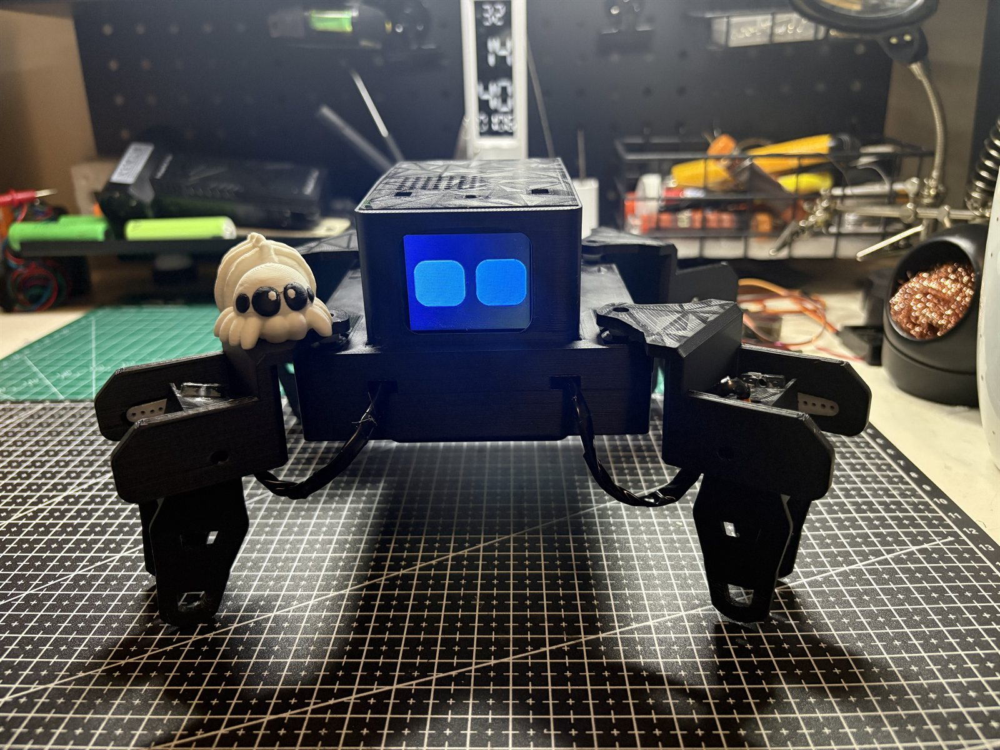

# Momo

Built by Eben Siyabalapitiya.



Momo is a four legged robot spider I built from scratch, running on a Raspberry Pi Zero W. It has a little screen for a face, it walks, and you can actually talk to it. It listens to you, sends what you said to Google's Gemini AI, and replies out loud with a personality I wrote for it, plus it can wave, walk, sit, dance, and pose for pictures.

I started this as a personal project to learn about robotics, wiring, and building something that actually works end to end instead of just following a tutorial. Everything here was built piece by piece: WiFi, servos, the screen, the mic and speaker, then the AI on top.

## What it can do

- Talks back when you speak to it, using Gemini for the replies and espeak for the voice
- Has an animated face with 23 expressions, and the eyes blink, drift around, and change shape on their own when nothing is happening
- Walks forward and backward, turns, sits, stands, waves, dances, and holds a pose for photos
- Handles more than one instruction at a time, so "sit down then stand back up" runs both moves in order
- Shows things on the screen when you ask, including an analog clock for the time and an animated icon that matches the actual weather
- Speaks up on its own if nobody has said anything to it for a few minutes
- Remembers things you tell it between conversations
- Has a web control panel you can open from your phone to drive it around, preview every face, watch the conversation live, rewrite its personality, or set up WiFi
- Makes its own WiFi hotspot if it cannot find a known network, so you can set it up somewhere it has never been

## How it works

The same loop runs every time you say something.

The microphone records through the `speech_recognition` library, and the audio gets boosted in software before it goes anywhere, since the raw signal off the mic is quiet. Google's speech API turns that into text. If the sentence mentions the time or the weather, the real values get looked up first and passed along as facts, so the answer is accurate instead of made up.

That text goes to Gemini together with Momo's personality, its long term memory, and the last few exchanges. The part that ties the whole robot together is that Gemini has to reply in JSON rather than plain text:

```json
{
  "say": "yeah nah, too lazy for that one",
  "face": "smug",
  "actions": ["sit", "stand"],
  "show": null,
  "remember": null
}
```

One response decides five things at once: what to say out loud, which expression to switch to, which physical moves to run and in what order, whether to put anything on the screen, and whether anything from the conversation is worth keeping permanently. Everything gets checked on the way back in, so a face or an action that does not exist gets dropped instead of breaking anything.

The expression changes, the legs start moving on a background thread, and the speech plays at the same time, so the movement and the talking overlap rather than queueing up one after the other.

## Hardware

- Raspberry Pi Zero W
- PCA9685 servo driver board, controlling 8 MG90S servos (2 per leg)
- ST7735 1.8 inch SPI screen for the face
- I2S microphone and a MAX98357A amplifier driving a small speaker
- Everything powered off a battery through a couple of UBECs, one for the Pi and a separate one for the servos

## How the code is laid out

Everything you actually need to build and run Momo lives in `core/`. Everything else in the repo is either testing scripts or deployment config, not code the robot needs to function.

- `core/voice.py` is the main program, it listens for speech, sends it to Gemini, gets a reply back, and speaks it while triggering whatever face or movement fits
- `core/web.py` runs the Flask web control panel
- `core/face.py` draws and animates the eyes on the screen
- `core/gait.py` has all the walking, turning, waving, sitting, and posing logic
- `core/servos.py` is the low level code that actually talks to the servo board
- `core/persona.py` holds Momo's personality and how it's told to respond, editable live from the web panel
- `core/voice_settings.py` stores the voice volume, speed, and pitch settings
- `core/wifi_setup.py` and `core/wifi_boot_check.py` handle the WiFi hotspot fallback
- `core/boot_splash.py` shows a "waking up" animation on the screen while everything else is starting
- `systemd/` has the service files that make everything start automatically when the Pi boots
- `testing/` has the small scripts I used to test individual hardware pieces (screen, servos, mic) before writing the real code, see the README in there for details

## Setup

This isn't really plug and play since it depends on my exact wiring, but if you're working from similar hardware, the systemd service files in `systemd/` show how everything is set up to run automatically, and the code itself is fairly straightforward to follow. You'll need your own Gemini API key in a `.env` file.

On the actual Pi, the files inside `core/` all sit together in one flat folder rather than a subfolder, since they look for each other and for their saved data (memory, settings, calibration) right next to themselves. If you're setting this up yourself, just keep everything from `core/` together in whatever folder you point the systemd services at.

## Author

Built and maintained by Eben Siyabalapitiya.

- Portfolio: https://ebensiyabalapitiya.site
- GitHub: https://github.com/Eben-Siyabalapitiya
- LinkedIn: https://www.linkedin.com/in/eben-siyabalapitiya/

## License

MIT, see LICENSE.
